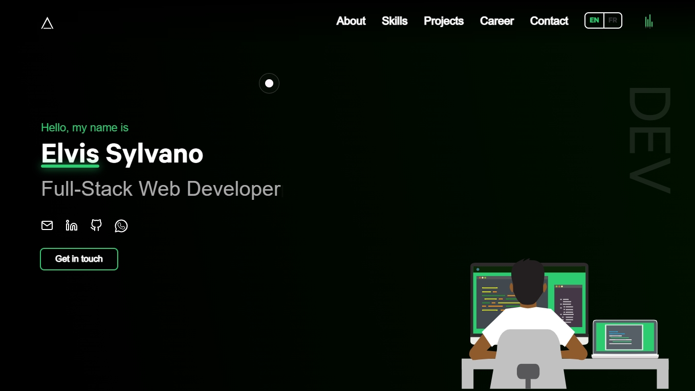

# Portfolio

👨‍🎓 Welcome to my personal portfolio! This project showcases my skills, experience, and projects as a developer/problem solver.

### ✨ [Live Demo](https://es-portfolio-three.vercel.app)

## About

This portfolio project is built upon a modern, responsive template which I have customized to fit my personal style and showcase my skills. The template provided a solid foundation, allowing me to focus on adding my own projects, experiences, and content.

It demonstrates my proficiency in **React**, **Next.js**, **Tailwind CSS** and serves as a professional presentation of my work.

Feel free to explore the site to learn more about my skills and projects.

## Technologies Used

- React / Next.js
- Tailwind CSS / SCSS
- JavaScript
- Framer Motion (for animations)
- Vercel (for deployment)

---

*This site is based on a template by Shubh Porwal [https://shubhporwal.me], customized and modified by Elvis Sylvano.*

